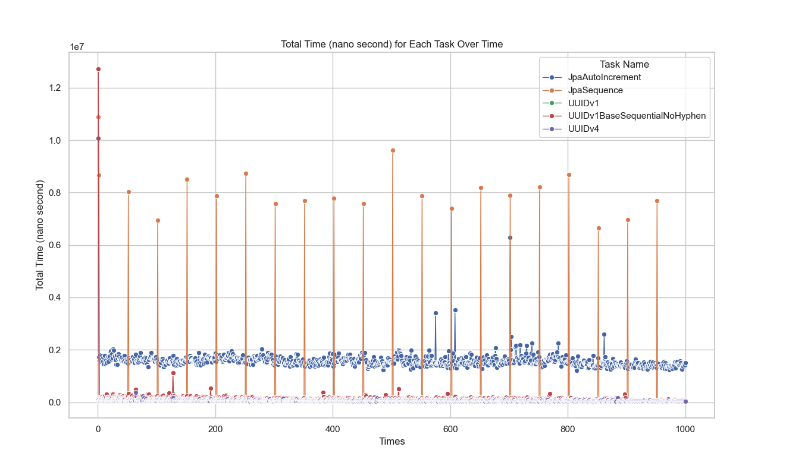
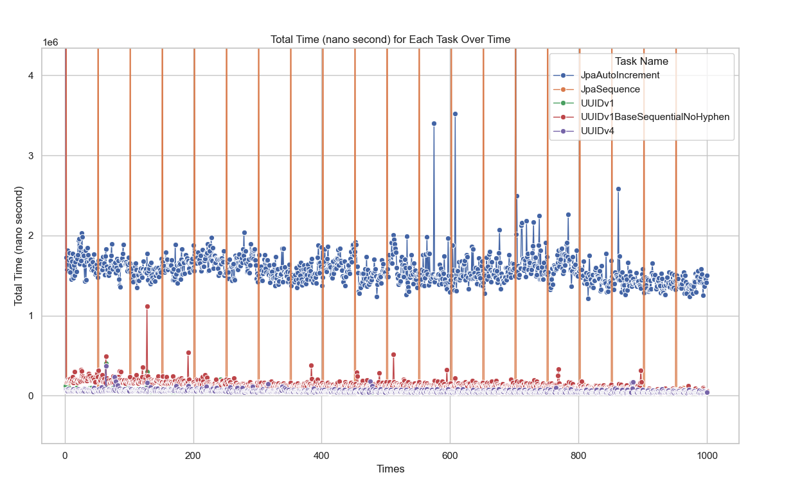

# Summary
JPA를 이용한 MySQL PK 성능 테스트 및 테스트 수행 속도 개선

## MySQL PK 성능 테스트
### Core concept
#### Insertion test

- 쓰기 지연이 아닌 즉시 commit이 일어나야 함
- 선언적 transactional 적용 시 주의
### Reports
#### 1000 times (Single thread)

## 테스트 수행 속도 개선
1. N threads per method + for loop (n=3, 15 thread)
    - n = ForkJoinPool thread 개수 / Test method 개수
    - test 환경 n = 15 / 5 = 3
2. Thread per method + for loop (5 thread)
3. Single thread (1 thread)

### 총 수행 시간 측정 방법
`TestExecutionListeners`에 `DefaultTestTimeExecutionListener`를 추가
#### DefaultTestTimeExecutionListener

### N threads per method + for loop
- Concurrency로 설정 후 RepeatedTest시 repeatedTime 마다 서로 다른 thread에서 수행되는 것을 이용
  - `@ReapeatedTest(value)`에 할당하고자 하는 thread 개수 기입
  - 원하는 insertion 개수 / `@ReapeatedTest(value)` 만큼 for-loop의 iteration 기입
- 각 thread에서 호출되는 insertionTest끼리 순서를 알 수 없음
  - 어떤 entity가 먼저 삽입될지 알 수 없음
  - persist 시간 역시 측정 대상이므로 StopWatch의 task name으로 pk를 지정 불가
  - PK와 TaskInfo를 key - value로 map에 넣음
  - entity에는 created at column 추가, 해당 정보는 database에서 insert 시점에 작성하도록 함
- Thread local map 에 넣은 후 iteration이 끝나면 ConcurrentMap에 putAll
  - ConcurrentMap에 각 iteration마다 Pk-task mapping 정보 삽입 시 lock이 걸려 성능 저하가 발생할 것이라고 예상
  - for-loop 안에서 thread local map에 넣어두었다가 loop가 끝나면 ConcurrentMap에 putAll
- OrderBy createdAt으로 읽어 온 후 해당 list를 순회하며 ConcurrentMap에서 해당 pk에 대한 TaskInfo를 가져옴
  - Taskinfo에서 nanoSecond 정보를 가져와 csv 작성
#### Rough concept
@RepeatedTest(value = N = 2)
- 원하는 insert time이 100, n=2인 경우 loop iteration = 100 / 2 = 50

#### Measure time and save mapping info

[//]: # (### Thread per method + for loop)

[//]: # (sequenceDiagram)

[//]: # (    actor Junit)

[//]: # (    participant )

[//]: # (    actor Junit)

[//]: # (    participant PrimaryKeyPerformanceTestMultiThreadV1)

[//]: # (    participant ParallelTestTimeExecutionExportListener)

[//]: # (    participant DefaultTestTimeExecutionListener)

[//]: # (    participant PrimaryKeyPerformanceTestMultiThreadInternal)

[//]: # (    participant StopWatch)

[//]: # (    participant ThreadLocal StopWatch)

[//]: # ()
[//]: # ()
[//]: # (    par Jpa auto increment)

[//]: # (        Junit ->>+ ParallelTestTimeExecutionExportListener : create PrimaryKeyPerformanceTestMultiThreadV1)

[//]: # (        ParallelTestTimeExecutionExportListener ->>+ ParallelTestTimeExecutionExportListener: super.beforeTestClass)

[//]: # (        ParallelTestTimeExecutionExportListener ->>+ DefaultTestTimeExecutionListener: beforeTestClass)

[//]: # (        DefaultTestTimeExecutionListener ->>+ StopWatch: start )

[//]: # (        StopWatch -->> DefaultTestTimeExecutionListener: "")

[//]: # (        DefaultTestTimeExecutionListener ->>- ParallelTestTimeExecutionExportListener: "")

[//]: # (        ParallelTestTimeExecutionExportListener ->>- Junit: "")

[//]: # ()
[//]: # (        Junit ->>+ PrimaryKeyPerformanceTestMultiThreadV1 : jpaAutoIncrementWithCreatedTime)

[//]: # (        PrimaryKeyPerformanceTestMultiThreadV1 ->>+ PrimaryKeyPerformanceTestMultiThreadV1: insertTest)

[//]: # (        loop: iteration = insert time)

[//]: # (            PrimaryKeyPerformanceTestMultiThreadV1 ->>+ PrimaryKeyPerformanceTestMultiThreadInternal: persistEntiy)

[//]: # (            PrimaryKeyPerformanceTestMultiThreadInternal -->>- PrimaryKeyPerformanceTestMultiThreadV1: "")

[//]: # (        end)

[//]: # (        PrimaryKeyPerformanceTestMultiThreadV1 -->>- Junit: notify)

[//]: # (        Junit ->>+ ParallelTestTimeExecutionExportListener: afterTestClass)

[//]: # (        ParallelTestTimeExecutionExportListener ->>+ ParallelTestTimeExecutionExportListener: super.afterTestClass)

[//]: # (        ParallelTestTimeExecutionExportListener ->>+ DefaultTestTimeExecutionListener: afterTestClass)

[//]: # (        DefaultTestTimeExecutionListener ->>- StopWatch: stop )

[//]: # (       )
[//]: # (        )
[//]: # (     and Jpa sequence)

[//]: # (     Junit ->> PrimaryKeyPerformanceTestMultiThreadV1 : jpaSequenceWithCreatedTime)

[//]: # (     and UUIDV1)

[//]: # (     Junit ->> PrimaryKeyPerformanceTestMultiThreadV1 : uuidV1WithCreatedTime)

[//]: # (     and UUIDV4)

[//]: # (     Junit ->> PrimaryKeyPerformanceTestMultiThreadV1 : uuidV4WithCreatedTime)

[//]: # (     and UUIDV1 base sequential)

[//]: # (     Junit ->> PrimaryKeyPerformanceTestMultiThreadV1 : uuidV1BaseSequentialNoHyphenWithCreatedTime)

[//]: # (    end)

[//]: # (### Single thread)

#### Line graph

#### Efficiency ratio(time)

#### Thread efficiency

# Detail
## ERD
### v0 (Single thread, Thread per method + for loop)

### v1 (N threads per method + for loop)

### `Common`

**Description**
- `created_at`:
  > Default: CURRENT_TIMESTAMP(6)
  >
  > Extra: DEFAULT_GENERATED
  >
  > Null: YES
  
